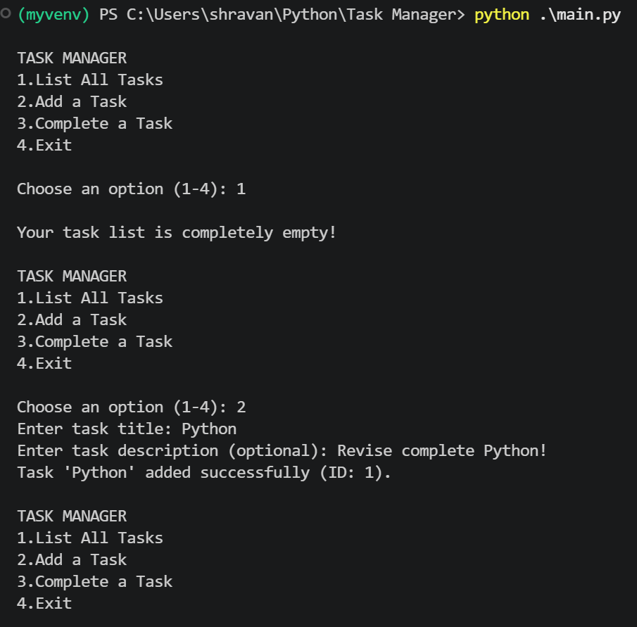
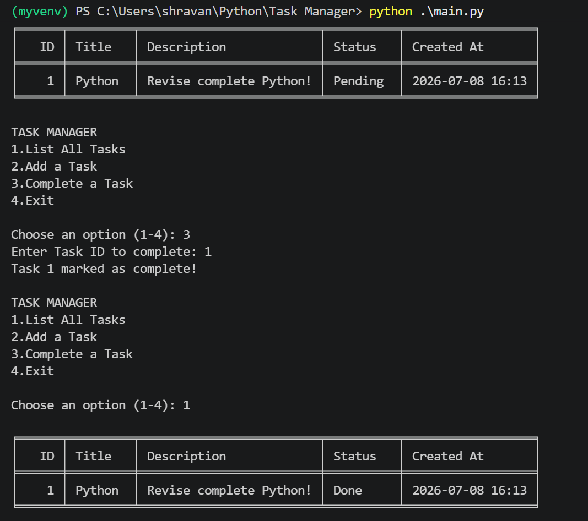

# PyTaskManager (CLI)

A clean, modular, object-oriented Command Line Interface (CLI) Task Manager built entirely from scratch with Python. This project serves as a practical blueprint for transitioning from basic scripting to professional, production-grade software architecture.

It utilizes an external formatting library (`tabulate`) to present data cleanly in the terminal, paired with local persistent storage (`JSON`) to ensure data survives across app restarts.

## 🚀 Features

- **Full CRUD-lite Operations:** Create, read, and update task workflows seamlessly from the command line.
- **Persistent Data Storage:** Automated JSON serialization and deserialization saves tasks to a local file.
- **Beautiful Terminal UI:** Implements structured, grid-based ASCII tables using the `tabulate` library.
- **Fail-Safe Design:** Built-in validation structures catch invalid terminal input and corrupted data files gracefully without crashing.

## 🏗️ Project Architecture

The workspace is organized using a professional package directory structure separating the data models, state engines, and application execution layers:

```text
task_manager/
├── assets/
│   ├── output-1.png
│   └── output-2.png
├── src/
│   ├── __init__.py      # Marks the directory as an importable package
│   ├── task.py          # Task data model and object state management
│   └── manager.py       # Storage engine, business logic, and I/O pipeline
│
├── main.py              # Application entry point & user interface loop
├── requirements.txt     # Tracked external dependencies
└── tasks.json           # Local auto-generated database file

🧠 Core Python Foundations Demonstrated
This codebase was designed to highlight essential computer science and Python specific standards:

Object-Oriented Programming (OOP): Deep usage of encapsulation, class states, object instantiation, and alternative factory methods (@classmethod).

Context Managers (with statement): Ensures safe file streams and deterministic system resource management during I/O operations.

Defensive Error Handling: Implements precise try/except blocks to isolate user tracking faults and JSONDecodeError events.

Strict Type Hinting: Utilizes Python's native typing module (List, primitive markers) to achieve self-documenting code and support IDE static analysis tools.

🛠️ Installation & Setup
Clone the repository:

Bash
git clone [https://github.com/shravan6778/Task-Manager.git](https://github.com/shravan6778/Task-Manager.git)
cd py-task-manager
(Optional) Create and activate a virtual environment:

Bash
python -m venv venv
# On Windows:
venv\Scripts\activate
# On macOS/Linux:
source venv/bin/activate
Install the required packages:

Bash
pip install -r requirements.txt
💻 How To Run
Execute the entry file from the root directory:

Bash
python main.py
⚙️ Usage Example
Upon running the script, you will be prompted with an interactive menu:



📄 License
This project is open-source and available under the MIT License.
```
